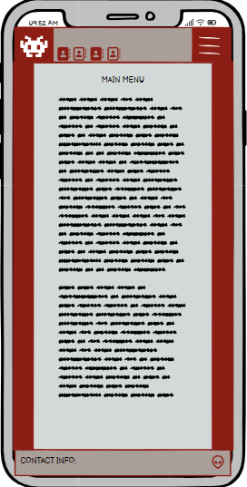
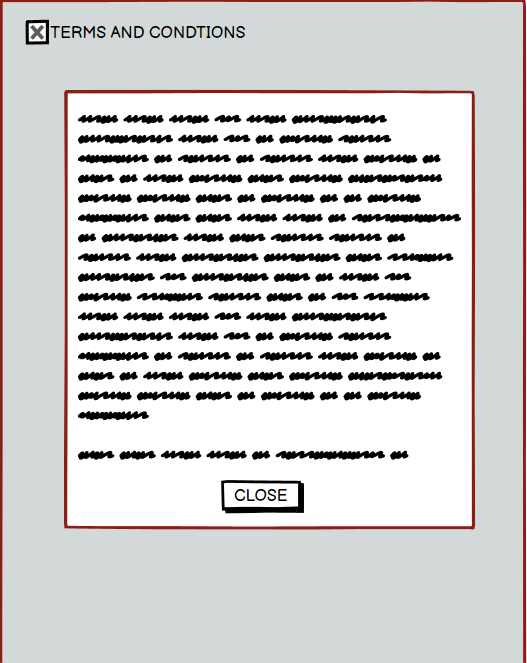

# Glass Fish Restaurant
## Introduction

## User Experience

### User Stories

## Wireframe Mockups!

### Home Page

### Menu Selection Page

### Main Menu Page

### Specials Menu Page

### Dessert Menu Page

### Drinks Menu Page

### Contact Page

### Booking Page

### Hamburger Menu Page

## Languages Used

## Future Enhancements

## Features

## Typography

## Color Scheme 

## Testing

## Notable Bugs

## Github Deployment
---
The project was deployed to GitHub Pages using the following steps...

1. Log in to GitHub and locate the [GitHub Repository](https://github.com/)
2. At the top of the Repository (not top of page), locate the "Settings" Button on the menu.
    - Alternatively Click [Here](https://raw.githubusercontent.com/) for a GIF demonstrating the process starting from Step 2.
3. Scroll down the Settings page until you locate the "GitHub Pages" Section.
4. Under "Source", click the dropdown called "None" and select "Master Branch".
5. The page will automatically refresh.
6. Scroll back down through the page to locate the now published site [link](https://github.com) in the "GitHub Pages" section.

* The live link can be found here.

### Making a Local Clone

If you would like to make a clone of this repository, you can type the following command in your terminal:
---
- `git clone https://pennytrain.github.io/lizardspock/`

### Forking the GitHub Repository
---
By forking the GitHub Repository we make a copy of the original repository on our GitHub account. Therefore we can view and/or make changes without affecting the original repository by using the following steps...

1. Log in to GitHub and find the [GitHub Repository](https://github.com/)
2. At the top of the Repository (not top of page) just above the "Settings" Button on the menu, locate the "Fork" Button.
3. You should now have a copy of the original repository in your GitHub account.

## Heroku Deployment
The site was deployed via Heroku, and the live link can be found here - 

The project was developed utilizing a Code Institute provided template. During the development of the project, the template was updated to increase functionality. I switched over to the new template mid-project which you can see within the commit history. Some of the deployment steps below are specifically required for the new CI template and may not apply to older versions, or different projects.
Project Deployment
To deploy the project through Heroku I followed these steps:
* Sign up / Log in to Heroku
* From the main Heroku Dashboard page select 'New' and then 'Create New App'
* Give the project a name - I entered Aston_Martin_Quiz and select a suitable region, then selected create app. The name of the app must be unique.
* This will create the app within Heroku and bring you to the deploy tab. From the submenu at the top, navigate to the settings tab.
* This next step is required for creating the app when using the CI Python Deployment Template. If you created your own program without using the CI Template, you might not need to add a config var.
* In the config vars section selects the reveal config vars button. This will display the current config vars for the app, there should be nothing already there.
* In the KEY input field input PORT all in capitals, then in the VALUE field input 8000 and select the Add button to the right.
* Next select the add buildpack button below the config vars section.
* In the pop-up window select Python as your first build pack and select save changes.
* Then repeat the steps to add a node.js buildpack.
* The order of the buildpacks is important, in the list Python should be first with Node.js second. If they are not in this order, you can click and drag them to rearrange.
* Next navigate back to the deploy tab using the submenu at the top of the page.
* In the deployment method section select the GitHub - Connect to GitHub button and follow the steps prompted if any to connect your GitHub account
* In the Connect to GitHub section that appears, select the correct account, and enter the name of the repository, and select search.
* Once Heroku has located the repo select connect.
* This will connect the repo to the app within Heroku. Below the Apps Connected to Heroku section will be the Automatic Deploys section.
* In this section, confirm the correct branch of the repo is selected in the drop-down box, and then click the Enable Automatic Deploys button
* This will ensure whenever you change something in the repo and push the changes to GitHub, Heroku will rebuild the app. If you prefer to do this manually you can utilize the manual deployment options further down. For this project, I utilized the Automatic Deployment to enable me to check changes I made to the app as I developed it.
* Heroku will now build the app for you. Once it has completed the build process you will see a 'Your App Was Successfully Deployed' message and a link to the app to visit the live site.
* There is then a link to run it in the heroku site which opens the game into a new separate tab.

Once in the file, Because I am including packages in the requirements.txt file. you must also do the following:

1: how to download just the packages required for this project (pip3 install -r requirements.txt)
and
2: how to freeze the commands for a local copy of this project on their own account (pip3 freeze --local > requirements.txt)

## Credits
--- 
### Content
---
* The text for all pages was created by myself.
* Icons used for the various links on the site were taken from [Font Awesome](https://fontawesome.com/)
* The reference material on HTML and CSS provided by [w3schools.com](https://www.w3schools.com/)

### Media
---
* The css reset was provided by [css reset](http://meyerweb.com/eric/tools/css/reset/)
* The Favicon, links and meta code were generated by [Realfavicongenerator.net](https://realfavicongenerator.net).
* The images used on the webisite were generated by [Pixabay](https://pixabay.com/photos/)

### Reference Material
---
* W3 Schools was used as a reference point for HTML, CSS and JavaScript.

### Acknowledgements
---
* I'd like to thank the following:
- Matt Bodden, for the significant ideas for my project - your guidance truly made a difference!
- Oliver Train, for all his help regarding his patience and pointing me in the right direction.
- Dario Carrasquel, for all his help during this project as my mentor.